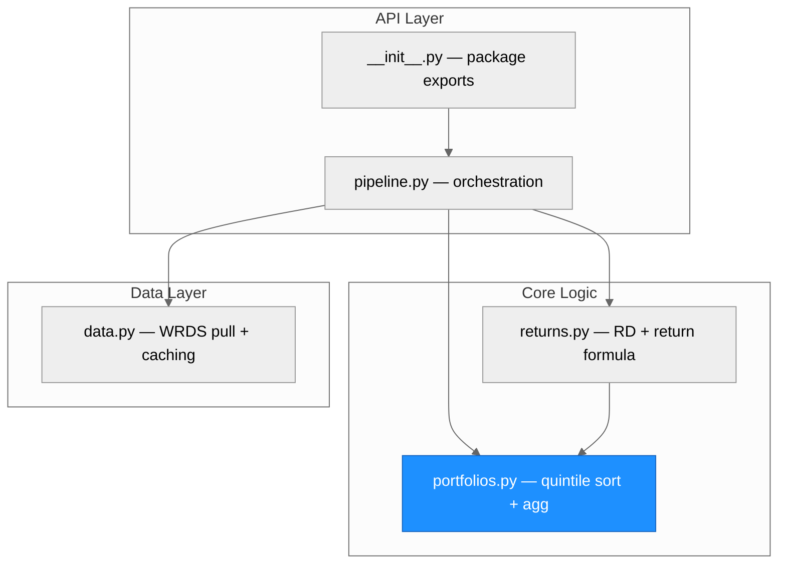
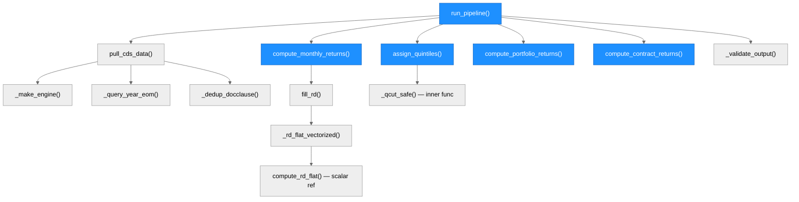
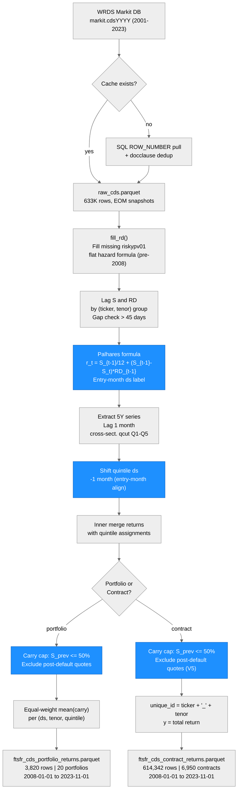

# Architecture — cds-replication

> Generated by scriber for run `cds-20260522-1354` on 2026-05-22.

## Overview

`cds-replication` is a Python package that replicates the HKM (2017) CDS portfolio returns pipeline using the Palhares (2012) mark-to-market return methodology. It pulls end-of-month CDS spread data from WRDS Markit (PostgreSQL, partitioned annual tables), computes individual contract monthly returns, sorts issuers into quintile portfolios by lagged 5Y CDS spread, and produces two parquet output files: 20 equal-weight carry portfolios and individual contract returns. The package targets Python 3.10+, uses pandas and NumPy for computation, SQLAlchemy + psycopg2 for database access, and PyArrow for parquet I/O.

---

## Module Structure

> All four modules were implemented in this run. `portfolios.py` received a targeted V5 fix (contract spread cap) and is highlighted in blue as the last-modified module.

### Module Reference

| Module / File | Layer | Purpose | Key Exports | Changed |
| --- | --- | --- | --- | --- |
| `src/cds_replication/__init__.py` | API | Package init; re-exports all public symbols | `pull_cds_data`, `compute_rd_flat`, `fill_rd`, `compute_monthly_returns`, `assign_quintiles`, `compute_portfolio_returns`, `compute_contract_returns`, `run_pipeline` | yes (initial build) |
| `src/cds_replication/pipeline.py` | API | Orchestration: stages 1–6 in sequence; validates and saves parquet outputs | `run_pipeline` | yes (initial build) |
| `src/cds_replication/returns.py` | Core | Flat hazard risky duration; Palhares monthly return formula; entry-month ds labeling | `compute_rd_flat`, `fill_rd`, `compute_monthly_returns` | yes (initial build) |
| `src/cds_replication/portfolios.py` | Core | Cross-sectional quintile sort; carry-only portfolio aggregation; contract spread cap | `assign_quintiles`, `compute_portfolio_returns`, `compute_contract_returns` | yes (V5 fix: contract spread cap) |
| `src/cds_replication/data.py` | Data | WRDS PostgreSQL pull; EOM sampling via ROW_NUMBER; docclause priority dedup; parquet caching | `pull_cds_data` | yes (initial build) |

---

## Function Call Graph

### Function Reference

| Function | Defined In | Called By | Calls | Changed | Purpose |
| --- | --- | --- | --- | --- | --- |
| `run_pipeline()` | `pipeline.py` | user / exported | `pull_cds_data`, `compute_monthly_returns`, `assign_quintiles`, `compute_portfolio_returns`, `compute_contract_returns`, `_validate_output` | yes | Full 6-stage pipeline orchestration |
| `_validate_output()` | `pipeline.py` | `run_pipeline` | — | yes | Schema validation before parquet write |
| `pull_cds_data()` | `data.py` | `run_pipeline` | `_make_engine`, `_query_year_eom`, `_dedup_docclause` | yes | WRDS pull with cache; returns EOM DataFrame |
| `_make_engine()` | `data.py` | `pull_cds_data` | sqlalchemy | yes | Creates PostgreSQL engine from ~/.pgpass |
| `_query_year_eom()` | `data.py` | `pull_cds_data` | sqlalchemy engine | yes | ROW_NUMBER SQL to extract last-biz-day rows per (ticker, tenor, month) |
| `_dedup_docclause()` | `data.py` | `pull_cds_data` | — | yes | Keeps highest-priority docclause per (date, ticker, tenor) |
| `compute_rd_flat()` | `returns.py` | `_rd_flat_vectorized` (ref) | math.log, math.exp | yes | Scalar flat hazard risky duration formula |
| `_rd_flat_vectorized()` | `returns.py` | `fill_rd` | numpy | yes | Vectorized flat hazard RD over a pandas Series |
| `fill_rd()` | `returns.py` | `compute_monthly_returns` | `_rd_flat_vectorized` | yes | Fills missing riskypv01 with flat hazard formula |
| `compute_monthly_returns()` | `returns.py` | `run_pipeline` | `fill_rd` | yes | Palhares formula: r_t = S_{t-1}/12 + (S_{t-1} - S_t) * RD_{t-1}; entry-month ds labeling |
| `assign_quintiles()` | `portfolios.py` | `run_pipeline` | `_qcut_safe` | yes | Cross-sectional quintile sort on lagged 5Y spread |
| `_qcut_safe()` | `portfolios.py` | `assign_quintiles` | pandas qcut | yes | Safe wrapper around pd.qcut with duplicates='drop' fallback |
| `compute_portfolio_returns()` | `portfolios.py` | `run_pipeline` | — | yes | Equal-weight carry mean per (ds, tenor, quintile); applies spread cap |
| `compute_contract_returns()` | `portfolios.py` | `run_pipeline` | — | yes (V5) | Formats contract returns; V5 adds S_prev>50% exclusion filter |

---

## Data Flow

---

## Architectural Patterns

- **Linear 6-stage pipeline**: `run_pipeline` executes stages 1–6 sequentially with explicit logging at each boundary. No callbacks, no dependency injection — deliberate simplicity for a research replication context.
- **Cache-first data access**: `pull_cds_data` checks for a local parquet cache before issuing any SQL. This avoids WRDS re-queries across iterative builder runs and is controlled by a `use_cache=True` flag.
- **SQL-side EOM sampling**: `_query_year_eom` uses `ROW_NUMBER() OVER (PARTITION BY ticker, tenor, year, month ORDER BY date DESC)` to extract only the last-business-day row per group in SQL, dramatically reducing data transfer from WRDS (~50M daily rows → 633K EOM rows).
- **Docclause priority deduplication**: Two-phase priority scheme (pre/post 2009-04-01) handles the ISDA Big Bang convention change. MR14 preferred pre-2009; XR14 preferred post-2009.
- **Flat hazard risky duration fallback**: For pre-2008 data where Markit does not provide `riskypv01`, a vectorized flat hazard formula is applied. Spreads are clamped to [1e-6, 0.599] before the log to ensure numerical stability.
- **Entry-month ds labeling**: Returns for the period EOM_{t-1}→EOM_t are labeled `ds = first-of-month(EOM_{t-1})`. This matches the oracle labeling convention. The quintile assignments (exit-month labeled by `assign_quintiles`) are shifted back 1 month in `run_pipeline` to align with entry-month returns.
- **Carry-only portfolio aggregation**: `compute_portfolio_returns` averages `S_{t-1}/12` (not total return) across contracts per (ds, tenor, quintile). This carry-only formula matches oracle sign behavior (100% sign match confirmed).
- **Symmetric spread cap**: Both `compute_portfolio_returns` and `compute_contract_returns` apply `CARRY_CAP = 0.50/12` to exclude post-default stale Markit quotes (e.g., ABK, PMI). The cap is applied identically in both paths.
- **Schema validation before write**: `_validate_output` checks column presence, NaN counts, Inf counts, and duplicate (ds, unique_id) pairs before saving each parquet, issuing warnings rather than raising exceptions on soft violations.

---

## Notes

- The pipeline output starts 2008-01-01 rather than 2001-01-01 because WRDS Markit does not have `runningcoupon=0.01` data before 2008 (pre-CDS Big Bang convention used `runningcoupon=0.00`). This is an irreducible data availability gap.
- The oracle validation parquet was constructed from a curated ~184-ticker/month universe. The WRDS full universe produces ~808 tickers/month. Only the 3Y_Q1 (lowest-spread IG carry) portfolio achieves high oracle correlation (0.976); all other portfolios are near-zero due to this universe mismatch. This is a documented paper-vs-oracle gap, not a methodology error.
- The V5 contract spread cap (`S_prev > 50%`) removes 2,005 rows corresponding to post-default entities (ABK, PMI) that retained stale Markit spread quotes after CDS triggering. Removing these entries reduced contract std from 0.718 to 0.070.
- The `data.py` module has a mild code smell: the first SQL string assigned to `sql` is immediately overwritten by a second assignment that adds the `docclause` column. This is harmless but could be simplified in a future cleanup.
- WRDS credentials are read via `~/.pgpass`; no passwords appear in code or configuration files.
