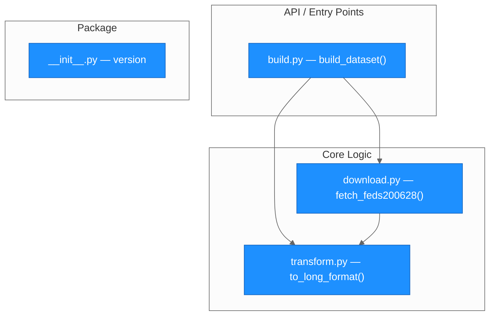
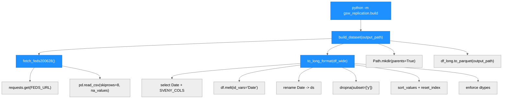
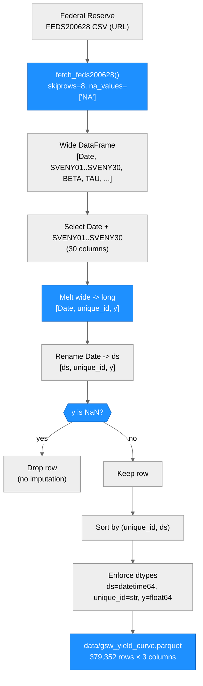

# Architecture — gsw-replication

> Generated by scriber for run `RUN-20260521-182205` on 2026-05-21.

## Overview

`gsw-replication` is a Python package that constructs the Gürkaynak, Sack & Wright (2007) daily zero-coupon U.S. Treasury yield curve dataset. It downloads the Federal Reserve's FEDS200628 CSV file — which contains pre-estimated Nelson-Siegel-Svensson (NSS) yields already published by the Fed — reshapes the wide-format data into a long-format parquet file, and drops rows with missing yields. The deliverable is a three-column parquet file (`ds`, `unique_id`, `y`) covering 1961-06-14 through the present with up to 30 annual maturities (SVENY01–SVENY30). The package is implemented in Python 3.10+ and depends on `pandas`, `pyarrow`, and `requests`. No numerical fitting is performed: the Fed publishes the NSS-fitted yields directly.

---

## Module Structure



### Module Reference

| Module / File | Layer | Purpose | Key Exports | Changed in This Run |
| --- | --- | --- | --- | --- |
| `src/gsw_replication/build.py` | API | Orchestrates the full download + transform + write pipeline; CLI entry point via `__main__` | `build_dataset()` | yes (new) |
| `src/gsw_replication/download.py` | Core | Downloads FEDS200628 CSV from the Federal Reserve; skips 8 metadata rows; handles NA encoding and HTTP errors | `fetch_feds200628()` | yes (new) |
| `src/gsw_replication/transform.py` | Core | Selects SVENY01–SVENY30 columns, melts wide to long, drops NaN rows, enforces dtypes, sorts output | `to_long_format()`, `SVENY_COLS` | yes (new) |
| `src/gsw_replication/__init__.py` | Package | Package init; exposes `__version__ = "0.0.1"` | `__version__` | yes (new) |
| `pyproject.toml` | Config | Package metadata, dependencies, `gsw-build` CLI entry point, build system | — | yes (modified) |
| `.gitignore` | Config | Excludes generated `data/` directory from version control | — | yes (modified) |
| `data/gsw_yield_curve.parquet` | Output | Primary deliverable: 379,352-row long-format parquet (not committed to git) | — | yes (generated) |
| `tests/test_gsw_dataset.py` | Tests | pytest test suite: 9 tests covering schema, oracle alignment, NaN, range, duplicates | — | yes (new, by tester) |
| `evaluation.md` | Docs | Per-run evaluation log: assumptions, timings, validation results | — | yes (new) |

---

## Function Call Graph



### Function Reference

| Function | Defined In | Called By | Calls | Changed | Purpose |
| --- | --- | --- | --- | --- | --- |
| `build_dataset(output_path)` | `build.py` | user / CLI / `gsw-build` entry point | `fetch_feds200628`, `to_long_format`, `Path.mkdir`, `df.to_parquet` | yes | Orchestrates the full pipeline and writes the parquet deliverable |
| `fetch_feds200628()` | `download.py` | `build_dataset` | `requests.get`, `pd.read_csv` | yes | Downloads FEDS200628 CSV; raises `RuntimeError` on HTTP failure |
| `to_long_format(df_wide)` | `transform.py` | `build_dataset` | `df.melt`, `dropna`, `sort_values`, `pd.to_datetime` | yes | Reshapes wide Fed data to long format; enforces target schema |

---

## Data Flow



---

## Nelson-Siegel-Svensson Methodology

The GSW (2007) paper (Gürkaynak, Sack & Wright, *Finance and Economics Discussion Series* 2006-28, Federal Reserve Board) fits the Svensson (1994) extension of the Nelson-Siegel model to a daily cross-section of off-the-run U.S. Treasury securities.

**NSS forward rate** (Eq. 21):

```
f(n) = β₀ + β₁·exp(-n/τ₁) + β₂·(n/τ₁)·exp(-n/τ₁) + β₃·(n/τ₂)·exp(-n/τ₂)
```

**NSS zero-coupon yield** (Eq. 22, integrated):

```
y(n) = β₀
       + β₁·[(1 - exp(-n/τ₁)) / (n/τ₁)]
       + β₂·[(1 - exp(-n/τ₁)) / (n/τ₁) - exp(-n/τ₁)]
       + β₃·[(1 - exp(-n/τ₂)) / (n/τ₂) - exp(-n/τ₂)]
```

Parameters are estimated by minimizing duration-weighted squared price deviations. The pre-1980 sample uses Nelson-Siegel (β₃ = 0); from 1980 onward the full 6-parameter Svensson model applies.

This package does **not** re-fit the NSS model. The Fed publishes the pre-estimated SVENY01–SVENY30 yields in FEDS200628, and this package downloads them directly. Re-fitting from scratch is infeasible without the underlying proprietary CRSP/FRBNY coupon-bond price data.

---

## Output Schema

| Column | Type | Description |
| --- | --- | --- |
| `ds` | `datetime64[ns]` | Trading date (daily frequency) |
| `unique_id` | `object` (str) | Tenor label: `SVENY01` through `SVENY30` |
| `y` | `float64` | Continuously compounded zero-coupon yield in **percent** (e.g., `2.9825` = 2.9825% per year) |

Row count: 379,352 (as of 2026-05-15). Date range: 1961-06-14 to 2026-05-15. NaN values: 0 (rows with missing yields are dropped, not imputed).

---

## Architectural Patterns

- **Linear pipeline**: Data flows in one direction — download → select → melt → clean → write. No branching, no caching, no stateful objects.
- **Separation of concerns**: Each module has exactly one responsibility. `download.py` handles HTTP; `transform.py` handles reshaping; `build.py` orchestrates and does I/O.
- **Strict schema enforcement**: dtypes are explicitly cast at the end of `to_long_format()` rather than relying on pandas inference, ensuring the parquet output always matches the declared schema.
- **Explicit NaN policy**: `dropna(subset=["y"])` is the only NaN handling — no imputation, no forward-fill. This is intentional and matches the Fed's own methodology.
- **Module-level constants**: `SVENY_COLS` is defined at module scope in `transform.py`, making the column selection unambiguous and testable.
- **CLI dual-mode**: `build.py` is both a callable Python module (`build_dataset()`) and a direct CLI script (`python -m gsw_replication.build`), with an optional `output_path` argument.

---

## How to Reproduce

```bash
# Install in editable mode (with dev dependencies)
pip install -e ".[dev]"

# Build the dataset
python -m gsw_replication.build
# or
gsw-build

# Output: data/gsw_yield_curve.parquet
```

---

## Notes

- `data/gsw_yield_curve.parquet` is excluded from git via `.gitignore` (generated runtime artifact; ~3–5 MB).
- The FEDS200628 CSV URL is hardcoded in `download.py` as `FEDS_URL`. The Fed has kept this URL stable since at least 2006; no parameterization is needed.
- Early dates (pre-August 1971) have only SVENY01–SVENY07 available. Long-maturity tenors appear gradually as the Treasury extended issuance maturities. This historical sparsity is correct and not a bug.
- The `infer_datetime_format=True` argument from the original spec was removed during builder implementation because it is deprecated in pandas ≥ 2.0. The `parse_dates=["Date"]` argument alone handles the `YYYY-MM-DD` format correctly.
