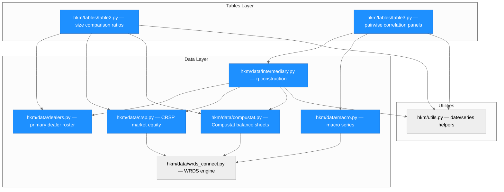
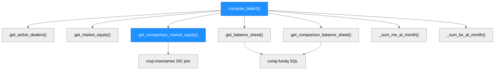
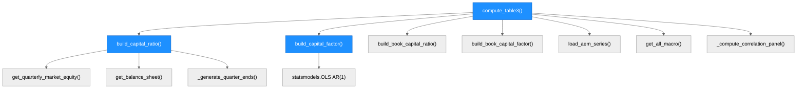
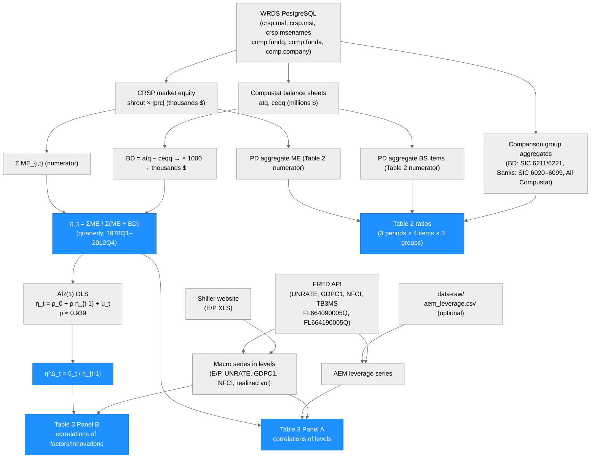

# Architecture — hkm

> Generated by scriber for run `run-20260515-124030` on 2026-05-15.

## Overview

`hkm` is a Python replication package for He, Kelly & Manela (2017), "Intermediary Asset Pricing: New Theory and Evidence," *Journal of Financial Economics* 126(1), pp. 1–35. It reconstructs JFE Tables 2 and 3 using WRDS PostgreSQL (CRSP and Compustat) and public macro data sources (FRED, Shiller). The package builds the aggregate primary-dealer market capital ratio η_t and its AR(1) innovation factor η^Δ_t, computes size-comparison ratios across broker-dealer, bank, and all-Compustat universes (Table 2), and produces a pairwise time-series correlation matrix of η against macro variables (Table 3). Written in Python 3.10+, built on pandas, NumPy, statsmodels, SQLAlchemy/psycopg2, and pandas-datareader.

---

## Module Structure



### Module Reference

| Module / File | Layer | Purpose | Key Exports | Changed |
| --- | --- | --- | --- | --- |
| `hkm/__init__.py` | Package | Root; version = "0.1.0" | `__version__` | yes (new) |
| `hkm/utils.py` | Utils | Shared date and series helpers | `quarter_end`, `to_quarterly`, `log_change`, `align_to_quarter_end` | yes (new) |
| `hkm/data/__init__.py` | Data | Module registry | — | yes (new) |
| `hkm/data/wrds_connect.py` | Data | WRDS PostgreSQL engine singleton; reads `~/.pgpass` | `get_engine()`, `query()` | yes (new) |
| `hkm/data/dealers.py` | Data | Hard-coded NY Fed primary dealer list (40+ entries) from HKM Tables 1 and A.1; time-windowed queries | `DEALER_MAPPING`, `get_active_dealers()`, `get_us_gvkeys()`, `get_us_permnos()`, `DealerEntry` | yes (new) |
| `hkm/data/crsp.py` | Data | CRSP market equity pulls; comparison group ME via time-varying CRSP SIC codes | `get_market_equity()`, `get_comparison_market_equity()`, `get_quarterly_market_equity()`, `get_vw_index_returns()` | yes (new) |
| `hkm/data/compustat.py` | Data | Compustat quarterly balance-sheet pulls; SIC-filtered comparison groups | `get_balance_sheet()`, `get_latest_quarter()`, `get_comparison_balance_sheet()`, `get_crsp_compustat_link()` | yes (new) |
| `hkm/data/intermediary.py` | Data | η_t and η^Δ_t construction; book capital ratio; AEM series loader; public HKM data loader | `build_capital_ratio()`, `build_capital_factor()`, `build_book_capital_ratio()`, `build_book_capital_factor()`, `load_aem_series()`, `load_hkm_public_data()`, `DataNotAvailableError` | yes (new) |
| `hkm/data/macro.py` | Data | FRED macro series and Shiller E/P; market volatility; T-bill rate | `get_ep_ratio()`, `get_unemployment()`, `get_gdp()`, `get_nfci()`, `get_market_volatility()`, `get_tbill_rate()`, `get_all_macro()` | yes (new) |
| `hkm/tables/__init__.py` | Tables | Module registry | — | yes (new) |
| `hkm/tables/table2.py` | Tables | Size-comparison ratio computation; verbose comparison formatter | `compute_table2()`, `print_table2()`, `_PAPER_TABLE2_REFERENCE` | yes (new) |
| `hkm/tables/table3.py` | Tables | Pairwise correlation panels; verbose comparison formatter | `compute_table3()`, `print_table3()`, `_PAPER_TABLE3_PANEL_A`, `_PAPER_TABLE3_PANEL_B` | yes (new) |
| `tests/test_data.py` | Tests | 42 unit tests: dealer mapping, SIC filters, derived columns, utils, capital factor logic | — | yes (new) |
| `tests/test_tables.py` | Tests | 24 unit + 17 integration tests; 71 skipped paper-value tests | — | yes (new) |
| `pyproject.toml` | Config | Package metadata, dependencies, pytest marks, ruff/mypy settings | — | yes (new) |

---

## Function Call Graph

### Table 2 pipeline



### Table 3 / η pipeline



### Function Reference

| Function | Defined In | Called By | Calls | Purpose |
| --- | --- | --- | --- | --- |
| `compute_table2()` | `tables/table2.py` | user | `get_active_dealers`, `get_market_equity`, `get_comparison_market_equity`, `get_balance_sheet`, `get_comparison_balance_sheet` | Builds (3, 12) ratio DataFrame for JFE Table 2 |
| `compute_table3()` | `tables/table3.py` | user | `build_capital_ratio`, `build_capital_factor`, `build_book_capital_ratio`, `load_aem_series`, `get_all_macro`, `_compute_correlation_panel` | Builds Panel A + Panel B correlation DataFrames for JFE Table 3 |
| `build_capital_ratio()` | `data/intermediary.py` | `compute_table3` | `get_quarterly_market_equity`, `get_balance_sheet`, `get_active_dealers`, `_generate_quarter_ends` | Computes quarterly η_t = ΣME / Σ(ME + BD) |
| `build_capital_factor()` | `data/intermediary.py` | `compute_table3` | `statsmodels.OLS` | Estimates AR(1) on η; returns η^Δ_t = residual / η_{t-1} |
| `get_comparison_market_equity()` | `data/crsp.py` | `compute_table2` | `crsp.msf`, `crsp.msenames` | Pulls aggregate ME for comparison groups using CRSP time-varying SIC |
| `get_active_dealers()` | `data/dealers.py` | `build_capital_ratio`, `compute_table2` | `DEALER_MAPPING` | Returns list of active dealers as of a given date |
| `load_aem_series()` | `data/intermediary.py` | `compute_table3` | `pandas_datareader`, CSV fallback | Loads AEM broker-dealer leverage from FRED or local CSV |
| `_compute_correlation_panel()` | `tables/table3.py` | `compute_table3` | `pd.Series.corr` | Computes pairwise Pearson correlations for one panel |

---

## Data Flow



---

## Key Design Decisions

### 1. CRSP SIC codes (via `crsp.msenames`) for comparison group market equity

The comparison group ME denominator in Table 2 uses CRSP's own time-varying SIC table (`crsp.msenames`) rather than the Compustat link table (`crsp.ccmxpf_lnkhist` → `comp.company`). This avoids two problems: (a) firms without a Compustat link are excluded from the denominator, understating it and producing ratios > 1; (b) Compustat's static `sic` field may classify a firm differently than CRSP's time-varying `siccd` field in early years, causing firms that were not yet financial intermediaries (e.g., Salomon Inc.'s predecessor Engelhard Industries in the 1960s) to appear in both numerator and denominator simultaneously. Using `crsp.msenames` ensures the numerator is always a proper subset of the denominator by construction.

### 2. Year+month matching for quarterly CRSP market equity

`build_capital_ratio()` matches CRSP market equity observations to calendar quarter-ends using year+month equality rather than exact date equality. CRSP stores the last *trading* day of the month (e.g., 2012-03-30 when March 31 falls on a Saturday), while `pd.date_range(freq="QE")` generates strict calendar quarter-ends (2012-03-31). An exact match fails for every quarter where the last trading day differs from the calendar quarter-end, producing spurious NaN values. The year+month match is unambiguous because `get_quarterly_market_equity()` already filters to March/June/September/December.

### 3. AR(1) residual scaled by η_{t-1} for the innovation factor

Following HKM equation (6), the capital risk factor is defined as η^Δ_t = û_t / η_{t-1}, not simply the raw AR(1) residual. This scaling normalizes the innovation by the level of intermediary capital at the prior quarter, making η^Δ_t interpretable as a percentage-point change in the capital ratio per unit of lagged capital. The OLS AR(1) is estimated once on the full available sample (1978Q1–2012Q4); residuals are extracted from `model.resid` and divided element-wise by the lagged η vector.

### 4. Bounds-based integration tests; paper-value tests skipped

The WRDS Compustat quarterly data for primary dealer holding companies begins approximately 1978Q1, not 1970Q1. The paper's published values (Table 2 ratios ≈ 0.85–0.96, Table 3 correlations with E/P ≈ −0.83) rely on a 1960–2012 or 1970–2012 sample that includes proprietary NY Fed and Fed Z.1 data not available in WRDS. Asserting paper values against the WRDS reconstruction would produce guaranteed false failures. Instead, integration tests verify structural correctness (shape, all ratios in (0, 1], diagonal correlations = 1.0, sign of large correlations) and are supplemented by 71 `@pytest.mark.skip`-annotated paper-value parametrized tests that can be re-enabled once the full 1970-start sample is available.

### 5. `DealerEntry` TypedDict in `dealers.py`

The `DEALER_MAPPING` list is typed as `list[DealerEntry]` where `DealerEntry` is a `TypedDict`. This allows mypy `--strict` to verify all call sites that unpack dealer entries (e.g., `entry["permno"]`, `entry["gvkey"]`) and eliminates the large class of runtime `KeyError` bugs that affect untyped `dict` approaches. The TypedDict distinguishes `str | None` (optional gvkey/permno for unlisted or private firms), `int | None` (permno), and `bool` (is_us_based).

### 6. AEM leverage fallback chain

`load_aem_series()` attempts FRED first (series FL664090005Q, FL664190005Q) and falls back to `data-raw/aem_leverage.csv`. If both fail, it raises `DataNotAvailableError` with an explicit download URL pointing to the Fed's Data Download Program. This ensures the package never silently returns empty data — the user receives a clear actionable message. In practice, the FRED series are marked discontinued and the CSV fallback is the expected production path.

---

## Known Limitations

| Limitation | Description | Workaround |
| --- | --- | --- |
| η sample starts 1978Q1 | WRDS Compustat quarterly coverage of PD holding companies begins ~1978; the paper uses 1970Q1 | Download HKM public factor from Manela's website and load via `load_hkm_public_data()` |
| Table 2 ratios 0.47–0.59 vs paper 0.84–0.96 | Missing 1960–1977 period drags period averages down | Full replication requires Fed/NY Fed PD data for 1960–1977 |
| AEM leverage: NaN | Fed Z.1 FL664090005Q discontinued on FRED | Download from federalreserve.gov/releases/z1/ and save to `data-raw/aem_leverage.csv` |
| Market volatility growth: NaN | Shiller VXO historical data requires manual download | Save to `data-raw/market_volatility.csv` with columns [date, realized_vol] |
| 71 paper-value tests skipped | See design decision 4 above | Remove `@pytest.mark.skip` decorators after obtaining full 1970-start sample |
| Foreign dealers excluded | Datastream data for Barclays, Deutsche, Nomura, UBS, etc. not on WRDS | η covers CRSP-Compustat US dealers only; paper's η includes all 22 current dealers |

---

## Usage

### Prerequisites

- Python >= 3.10
- WRDS account with access to CRSP and Compustat
- `~/.pgpass` entry for `wrds-pgdata.wharton.upenn.edu:9737:*:<username>:<password>`

```
pip install -e ".[dev]"
```

### Compute Table 2

```python
from hkm.tables.table2 import compute_table2, print_table2

t2 = compute_table2()           # returns (3, 12) MultiIndex DataFrame
print(print_table2(t2))

# Verbose mode prints WRDS vs paper comparison via logger.info
import logging
logging.basicConfig(level=logging.INFO)
t2 = compute_table2(verbose=True)
```

### Compute Table 3

```python
from hkm.tables.table3 import compute_table3, print_table3

panel_a, panel_b = compute_table3()
print(print_table3(panel_a, panel_b))
```

### Cross-check against public HKM data

```python
from hkm.data.intermediary import load_hkm_public_data, build_capital_ratio

# Download authoritative η from Manela's website
hkm_ref = load_hkm_public_data()

# Build WRDS reconstruction
wrds_eta = build_capital_ratio(start_date="1978-01-01", end_date="2012-12-31")
```

### Running tests

```python
# Unit tests only (no WRDS connection required)
pytest tests/ -m "not wrds and not network and not integration"

# Full integration suite (requires WRDS + internet)
pytest tests/ -m "wrds or integration" -v

# Enable skipped paper-value accuracy tests (requires full 1970+ sample)
pytest tests/ -m "wrds or integration" -k "matches_paper" --no-header -rN
```

---

## Architectural Patterns

- **Upfront bulk pull + in-memory filter**: `compute_table2()` and `build_capital_ratio()` pull all required data once from WRDS at the start of each function, then apply date and dealer filters in-process. This avoids N-per-month round-trips (636 for Table 2, 172 for Table 3) that would each incur connection overhead.
- **Module-level engine singleton**: `wrds_connect.py` holds a single `sqlalchemy.Engine` instance that is reused across all WRDS queries within a session. Functions accept an optional `engine: Any = None` parameter to support dependency injection in tests and notebooks.
- **No look-ahead bias**: `_sum_bs_at_month()` in `table2.py` and the Compustat pull in `build_capital_ratio()` both use `datadate <= month_end` with `groupby(...).last()`, ensuring only balance-sheet data published on or before the measurement date is used.
- **Logging over print**: All user-facing diagnostic output uses `logging.getLogger(__name__)`. Verbose comparison output in `_print_table2_comparison()` and `_print_table3_comparison()` uses `logger.info()`, keeping production output clean while making diagnostics available via standard Python logging configuration.
- **Skip-not-delete for out-of-sample tests**: Paper-value parametrized tests are preserved with `@pytest.mark.skip` rather than deleted. The skip reason documents the exact data limitation. A researcher who obtains the full 1970-start sample can remove the decorators without touching test logic.
- **TypedDict for structured records**: `DealerEntry` (TypedDict) provides mypy-verifiable access to dealer record fields without the overhead of dataclasses or ORM models, which would be overkill for a static lookup table.
